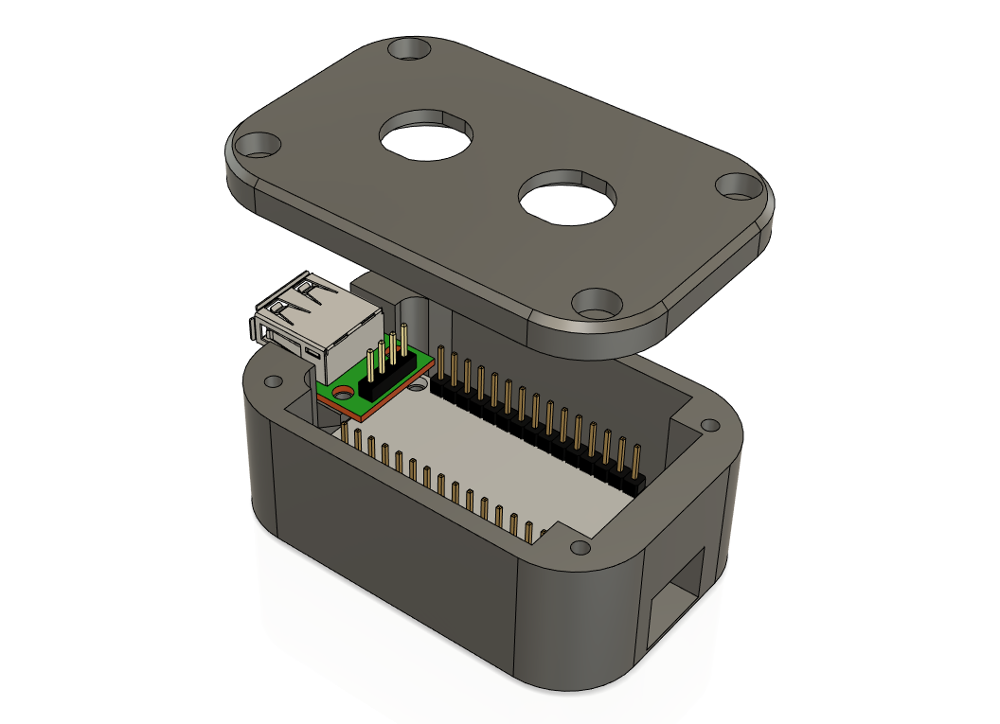
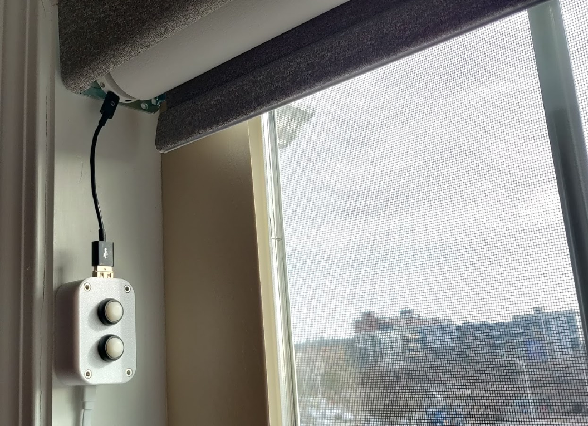
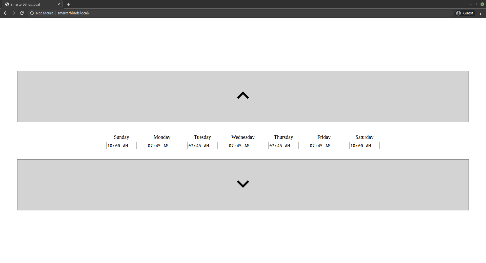

# Overview
<p align="center">
</img>


</p>
Blinds-To-Go sells motorized roller blinds controllable via a wand with two buttons, which connects to the blinds over Micro-USB. Unfortunately, it does not offer any smart functionality, but having a Micro-USB connection makes it very hackable. Hooking up the wand to a breakout board shows that Up and Down buttons short D+ / D- pins to ground. This project replaces the wand with an ESP8266 microcontroller to allow raising blinds on schedule as well as remote control via the phone / browser. 


I'm not associated with Blinds-To-Go and I'm not responsible for any damage caused to or by your blinds. With that being said, hack away!

# Description
Once you flash your microcontroller with the provided code and plug it in, it will:
* Attempt to connect to WiFi. If this is the first time you're starting it up, or if the existing WiFi configuration is no longer valid, it will host an unsecure SmarterBlinds WiFi hotspot. Connect to it via your phone, go through captive portal and connect it to your WiFi.
* Once WiFi is connected, the controller will start an mDNS service so you can access it at http://smarterblinds.local If you don't have mDNS, you'll have to figure out the assigned IP from your router.
* The web page has simple up and down controls to mimic the wand button behavior - you have to press and hold the buttons for about a second for the blinds to go up or down. The web page also allows you to set a time for each day to raise the blinds to the `Favorite 1` position (the position when you double-click the Up button).
* ESP8266 does not have a real time clock, but since we have WiFi we can keep time using NTP. This allows the controller to match current time against the specified schedule.
* ESP8266 needs constant USB power. The good news is that it will also keep your blinds fully charged.

# Setup
* In the `stls` folder, you'll find a case that will fit an ESP8266 board, a USB breakout board and 2 buttons. It can be 3D printed without supports. The buttons I used can be found by searching for `12mm Waterproof Momentary N.O. Push Button Switch`. The case is kept closed by 4 M3 6mm bolts. You will need 2 more M3 6mm bolts for the USB board.
* At the top of the Arduino sketch, you can see (and change, if you'd like) the pins in use:
    ```
    #define UP_PIN 4
    #define DOWN_PIN 5
    #define BUTTON_UP_PIN 12
    #define BUTTON_DOWN_PIN 14
    ```
* Solder the pins to the USB breakout board as follows:
    * UP_PIN to D+
    * DOWN_PIN to D-
    * Vin to VBus
    * Gnd to Gnd
* Solder the buttons to the pins as follows (polarity doesn't matter):
    * Up Button to BUTTON_UP_PIN
    * Down Button to BUTTON_DOWN_PIN
    * Other contact of each button can be soldered together and then soldered to GND.